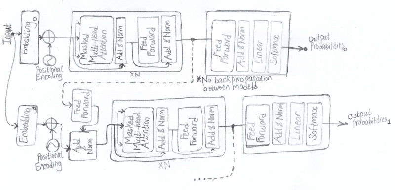
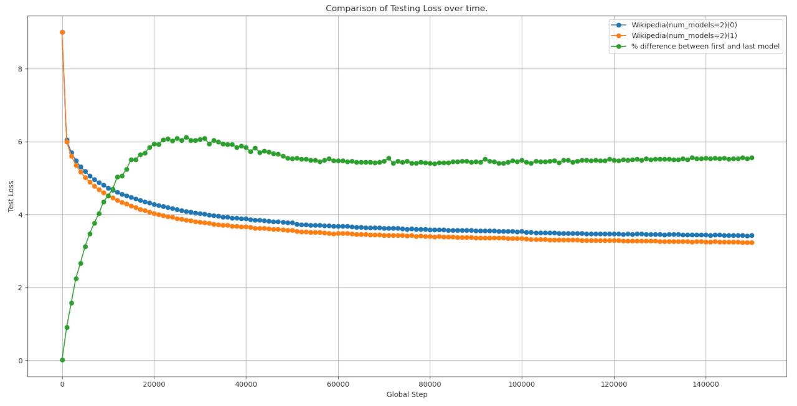

# Boosted Transformer
## Description
Ensemble learning is a general approach in Machine Learning that seeks to improve performance and generalization by combining multiple models together. One of the techniques used is called [Boosting](https://en.wikipedia.org/wiki/Boosting_(machine_learning)). Boosting works by using a sequence of models that are trained iteratively, where succeeding models correct the errors made by previous models. This project aims to employ this technique with Transformers where the intermediary outputs of the preceeding model is fed to the start of the succeeding model. Intuitively the succeeding models are resuming where the previous models stopped. Succeeding models don't backpropagate their gradients to the previous models so information can be thought as moving in only one direction.

## Architecture
<p align="center">
  
</p>

## Implementation
The project includes the following scripts and code:
- Script to generate Vocabulary dictionary.
- Script to generate subword dataset using Vocabulary.
- Script to generate train/test dataset.
- Script to generate testing loss .csv file using model checkpoints.
- Script to graph testing loss dataset from testing loss .csv files.
- Code to train model.

## Requirements
- Anaconda (Optional)
- Python 3

## Installing.
1. (Optional) Install [Anaconda](https://docs.anaconda.com/) on your machine.
    - Create anaconda environment:
    ```
    conda create --name <env_name> python=3.12
    ```
    - To activate anaconda environment, if not already activated:
    ```
    conda activate <env_name>
    ```
2. (If not installed) Install [Pytorch 2.5](https://pytorch.org/get-started/locally/) based on your hardware requirements and preferences.
3. Install Python depencies:
    ```
    pip install -r requirements.txt
    ```

## Dataset Creation (Needs to be run once)
Dataset used was [Plain Text Wikipedia 2020-11](https://www.kaggle.com/datasets/ltcmdrdata/plain-text-wikipedia-202011). Once downloaded, the json file was converted to raw plain-text files and all the Non-Latin characters like Greek symbols was removed (simplified the dataset). Script used for both operations are not provided!

### Generating vocabulary.
To generate vocabulary `.json` file, run the following (Needs to be generated first then subword dataset):
```
python scripts/generate_vocabulary.py <args>
```

### Generating subword dataset.
To generate subword dataset you need a `.csv` file listing all the raw `.txt` files from the dataset, run the following to generate a `.json` dataset file.
```
python scripts/generate_subword_dataset.py <args>
```

### Generating train/test dataset.
To generate the train/test dataset to be used for training model, run the following:
```
python scripts/generate_training_dataset.py <args>
```

## Training model.
To train the model, one first needs a config.json file (Example file can be found in **training_results/Misc/config.json**), then run the following:
```
python train_boosted_transformer_all.py <args>
```

## Results
Models were trained on an **RTX 3080** 10GB GPU. (For better quality images, script to chart losses from `.csv` files and other miscellaneous files go to **training_results/** folder)

<p align="center">
  
</p>

## Interpretation / Observation
Two models were trained at the same time on one GPU using the boosting architecture. The second model was ~5.5% better (lower loss) than the first model. Meaning there's a slight improvement as the second model is building on the work of the first. Attempting to scale up to 5 models, didn't lead to much improvement with succeeding models (I didn't create charts/logs for this due to slow training speeds).

In my opinion this technique may not be worth it as each model builds on the prior work so later models may lag in performance during early stages of training as the quality of information downstream is poor. This may require more training to allow the early models to converge first, such that the information flowing down will get better. Too much work for too little gain.

## Additional Relevant Links.
- [Attention Is All You Need](https://arxiv.org/abs/1706.03762)
- [Ensemble deep learning: A review](https://arxiv.org/abs/2104.02395)
- [Scaling Laws for Neural Language Models](https://arxiv.org/abs/2001.08361)
